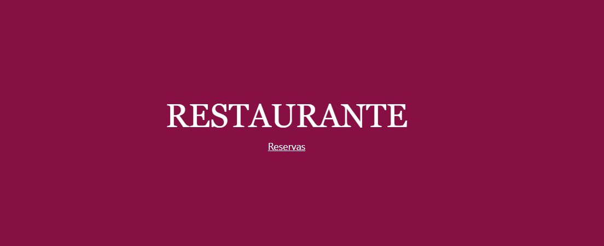
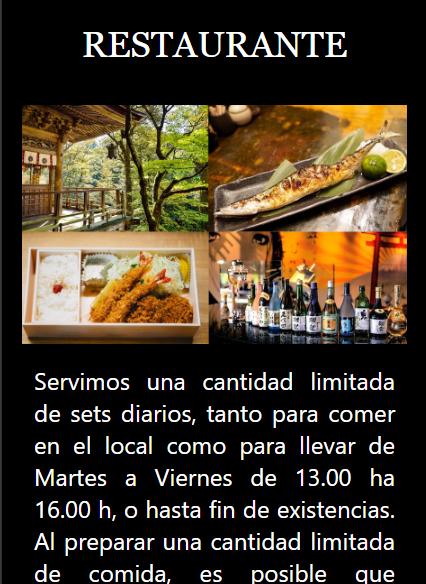
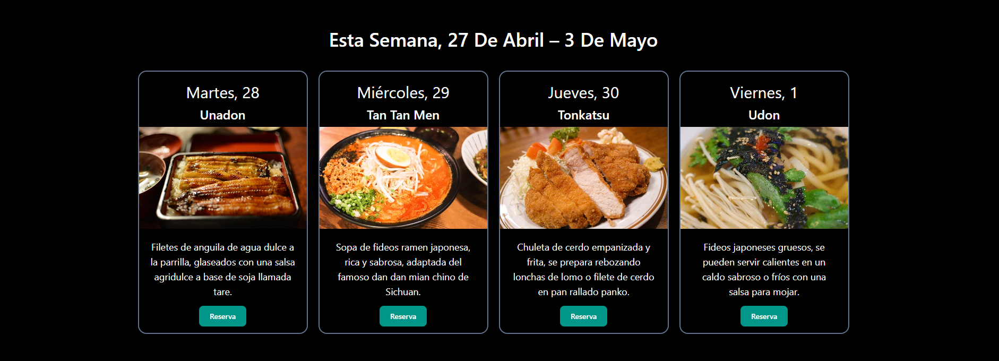
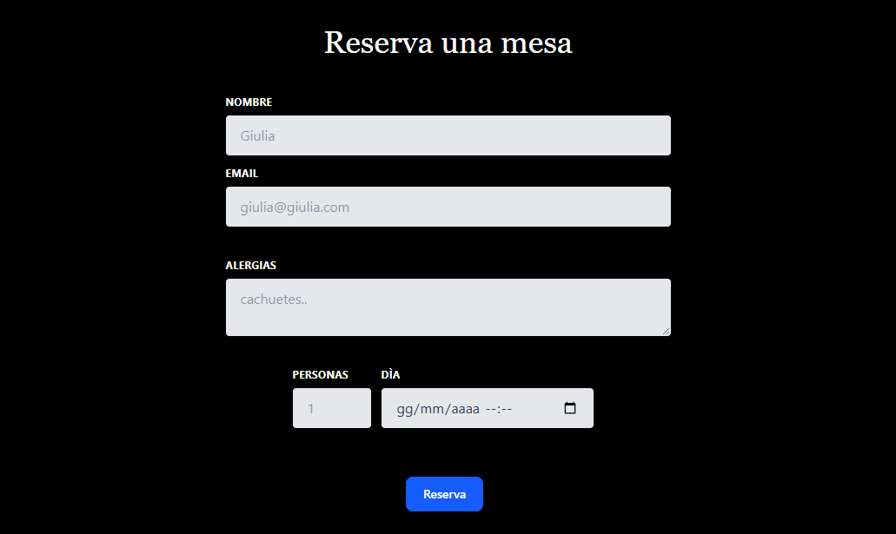

  <h3 align="center">Local Restaurant</h3>

    
  

## About The Project

A website dedicated to a beloved local restaurant. I'm currently working on expanding both the front and the back end of the project.

The project has a small backend with minimal functionalities to save/modify/delete reservations, handle the restaurant protected by a Login.

## To do

- randomize dish selection
- gestione calendario backoffice, scelta piatti
- gestione prenotazioni
- language ES/CAT
- date cannot be in the past when 'completed'
- front end should display available slots when booking now

